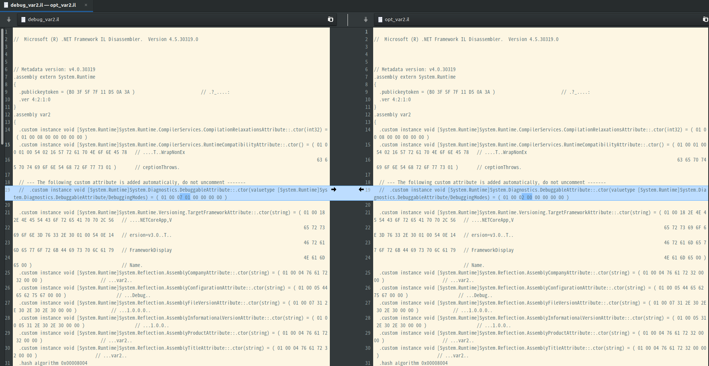
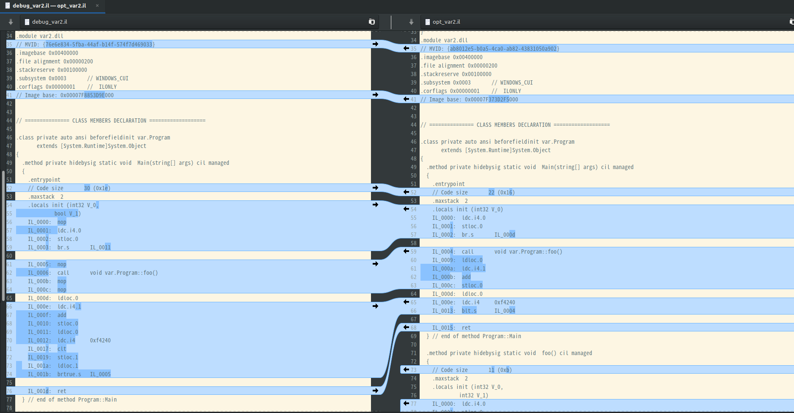
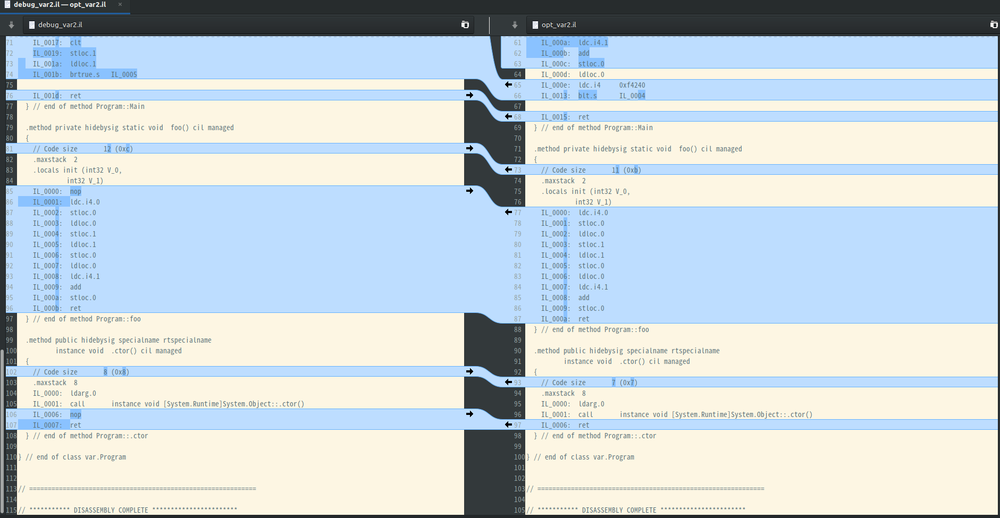

这是两个dll的反汇编，左边的是纯粹的debug版，右边是加了优化的debug版 

在csproj里加一行





```html
<Optimize>True</Optimize>
```

不一样的地方 

* System.Diagnostics.DebuggableAttribute: 估计是什么flag 
* MVID
* Image base
* 代码里删了一些NOP和连续的访存指令 

但运行翻译的代码还是很不一样的。比如foo函数实际上没什么用，在jit里
处理处理就没了。
