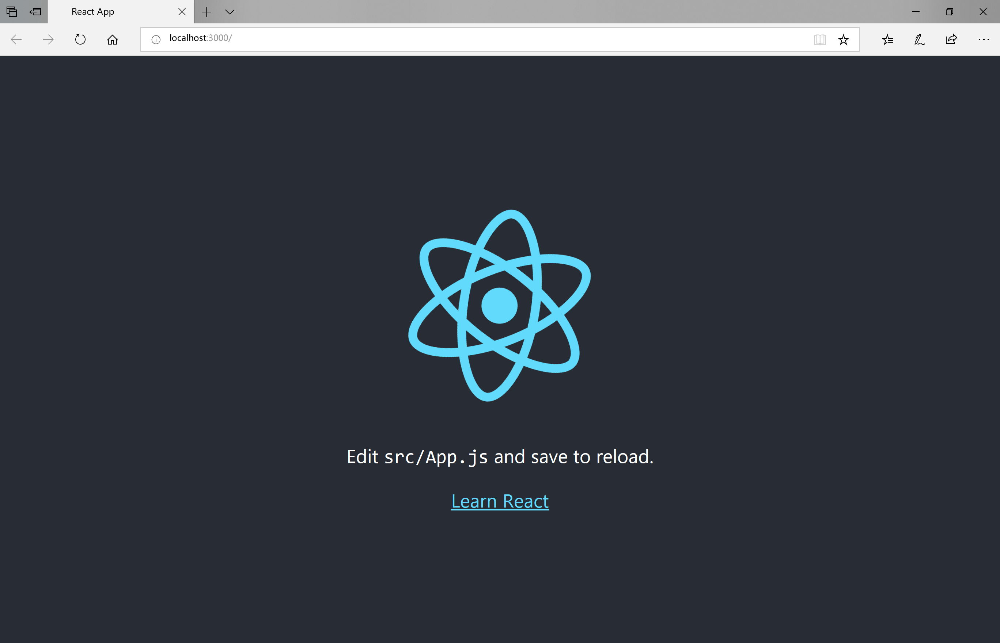
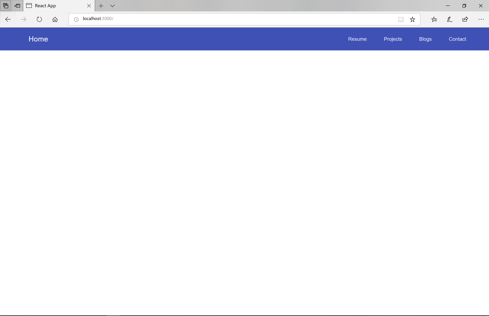
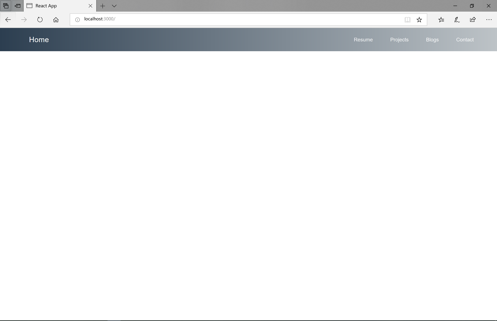
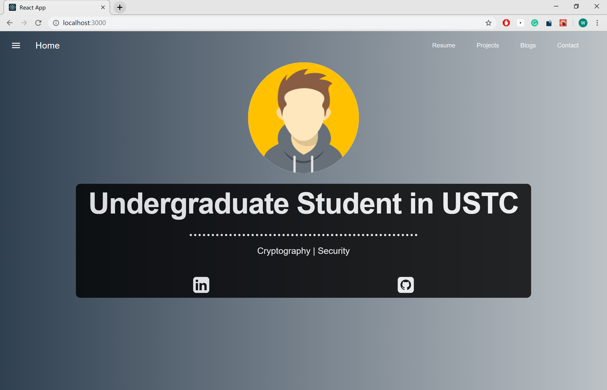
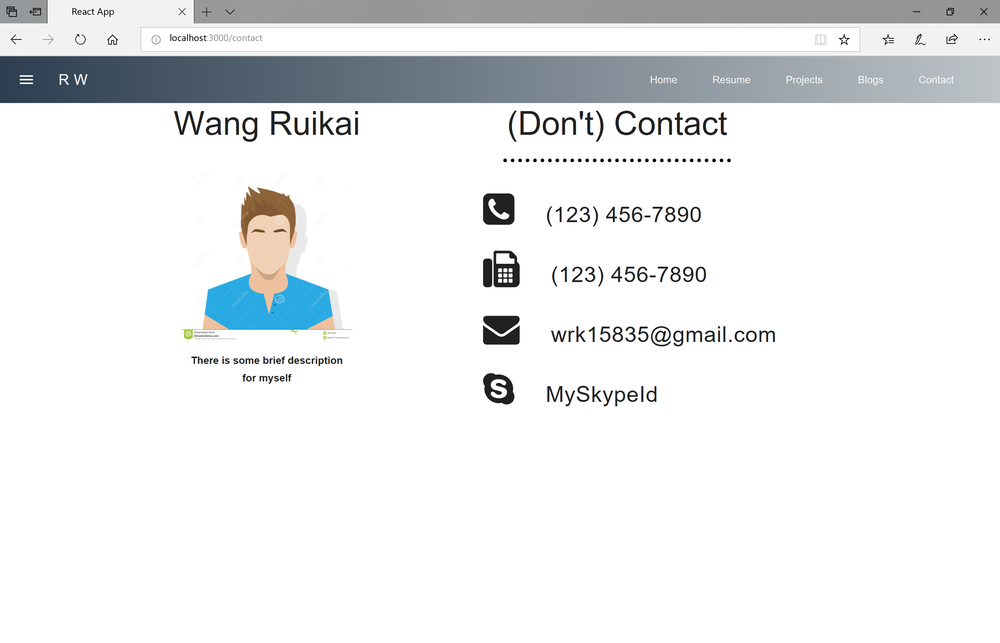
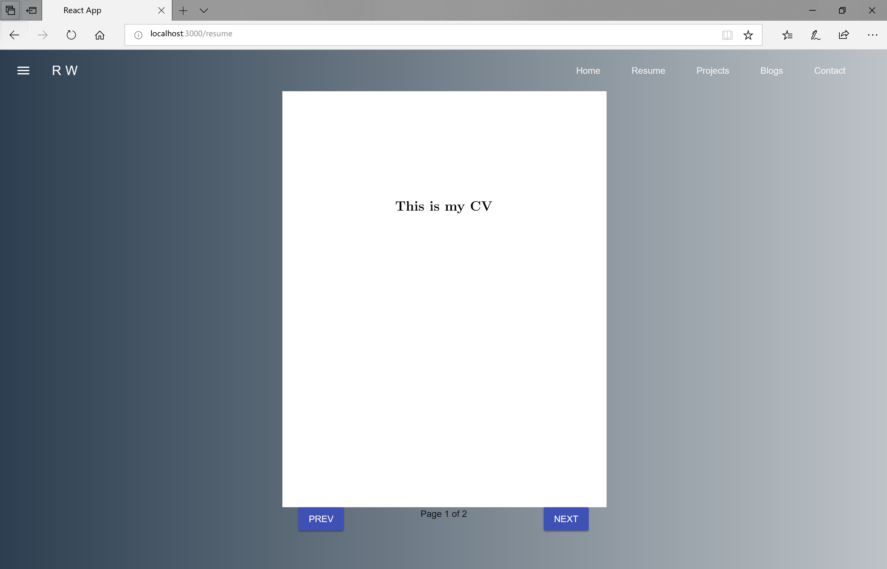

# DAY 1

* 前端项目创建
* 路由 
* layout 
* 静态页面

## 地址 

* [主页](https://w158rk.github.io/)
* [代码](https://github.com/w158rk/w158rk.github.io)

## 项目创建 

### 1 安装nodejs(npm)

直接从官网装就可以，对各种操作系统都很友好，在国内的话可以把源设置成淘宝镜像 

### 2 安装react并创建app

```shell
npm install --save react 
npm init react-app portfolio
cd portfolio 
npm install react-router react-router-dom
```

现在我们在目录`portfolio`中已经有项目的骨架结构了，进入目录，启动项目开发服务器 

```shell
cd portfolio 
npm start 
```

然后可以看到这样的初始界面



### 3 Layout 

然后我们为自己的项目搭一个layout，这个layout会显示在所有的界面中，用于功能页面的跳转。这里推荐两个前端框架，bootstrap和mdl，mdl里面有现成的layout，比bootstrap方便一些，所以在项目中导入mdl。

```sh
npm install react-mdl
```

在`index.html`中添加如下一行 

```html
<link rel="stylesheet" href="https://fonts.googleapis.com/icon?family=Material+Icons">
```

在mdl官网选择一个喜欢的layout复制到`App.js`

修改`index.js`

```js
...
import 'react-mdl/extra/material.css';
import 'react-mdl/extra/material.js';
import { BrowserRouter } from 'react-router-dom';

ReactDOM.render(
    <BrowserRouter>
        <App />    
    </BrowserRouter>, 
    document.getElementById('root'));
...
```

然后 ...


然后给它加点颜色吧，从[uigradients](https://uigradients.com)选一个喜欢的颜色，在`App.css`中创建一个新的样式附给`App.js`最外面的`div`

```html
    <div>
        <Layout>
            <Header className="header-color">
                ...
            </Header>
            ...
        </Layout>
    </div>  
```



### 4 路由

现在layout已经写好了，要管理组件于url之间的关系，需要新建一个路由组件，这个组件最外层为一个`<Switch>`标签，内部由`<Route>`构成。

```js
import React from 'react';
import { Route, Switch } from 'react-router-dom';
import LandingPage from './LandingPage';

const Main = () => (

    <Switch>
        <Route exact path="/" component={LandingPage} />
    </Switch>

);

export default Main;
```

然后再`App.js`中Layout下方增加<Main />组件，路由就搭建完了。

### 5 Landing Page 

在`src`中新建`components`目录，在目录中创建`LandingPage.js`。页面代码可以源代码自取，大部分源自[youtubu视频](https://www.youtube.com/watch?v=9AboneIxeM8)。

图标来自[fontawesome](https://fontawesome.com/)，但官网找不到CDN链接，可以直接google搜索`fontawesome cdn`就可以找到了。

**bug** : 这里的两个icon在edge上显示不了，好奇怪 



### 6 Contact Page

同样的，就是用html和css写的静态页面，没有什么特别的，可以在源代码中得到相关的代码 




### 7 Resume Page  

这一页是个大坑，有兴趣的可以到youtube上跟那个学习怎么用html写简历，但我因为有pdf版本的，所以就想用'react-pdf'来做，坑多到令人哭泣，直到现在，页面上的那两个按钮还不太认同他们自己的按钮身份，毫无反应。

**Bug:** 按钮无反应 

所以推荐这一页不要像我这么做，自己用html写一个简历或者找一个更好的pdf轮子。



### 8 build 

在package.json里面配置自己的主页地址，运行`npm run build`，把build里面的内容复制到主页地址目录下，把html部署到服务器能看到的地方就ok了