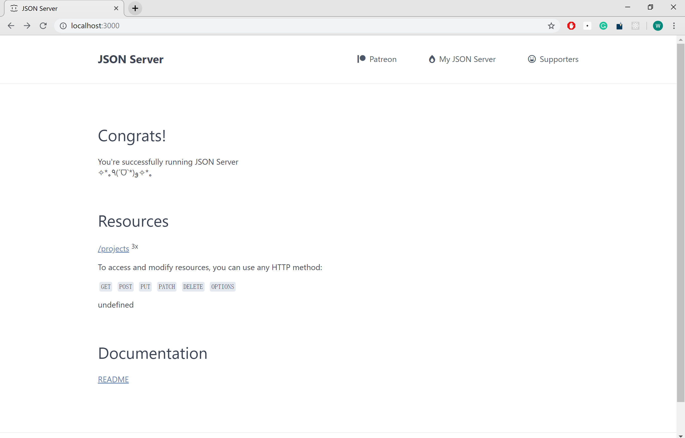
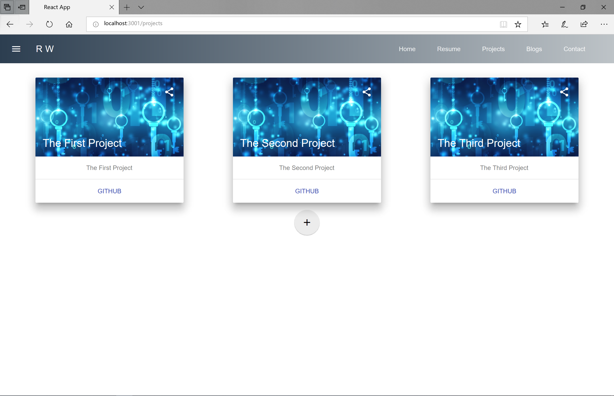
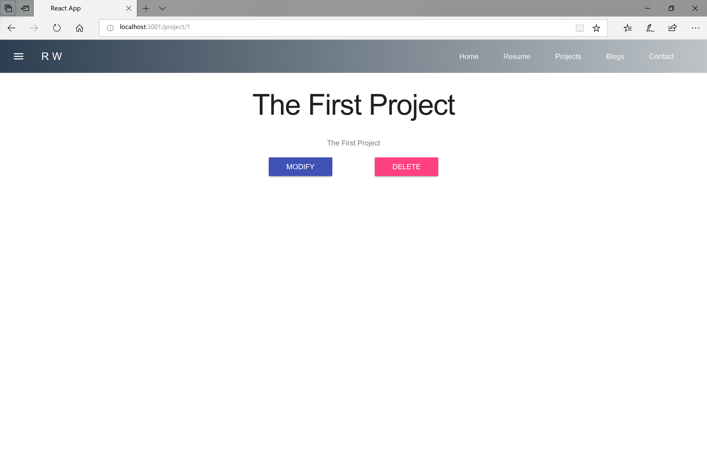

# D2

## Fixed Bugs 

昨天我就说边距怎么那么难调，今天发现了，`App.js` 里`<Main />`要放在`<Content>`里。

------

## 主要内容

* projects-project 显示页面 
* react-redux 入门 

## 地址 

* [主页](https://w158rk.github.io/)
* [代码](https://github.com/w158rk/w158rk.github.io)

------


## React-Redux 

即使官方文档说到Redux，总是说由action、store和component组成的MVC模型，但在我看到过
一些人的实现后，我的理解应该是以下五部分：

```
component - api - action - reduce -store 
```

逻辑是这样的：component的用户处得到一个事件，调用API的函数产生一个action对象，reducer
根据当前store的状态和action对象计算一个新的状态给store，store再为component提供数据

### 安装 

```sh 
npm install redux react-redux 
```

## Projects 

### Reducer 

我个人理解吧，reduce 就是连接store和action的中间部分，从action中获取类型和参数、
从store里获取状态，根据这些信息计算下一个状态，再提供给store.

所以所谓reduce其实就是一个函数，函数体是一个switch函数，大概像：

```js 

export default function(state, action) {
    switch(state) {
        case : 
            return action.payload;
        ...
        default : 
            return state;
    }
}

```

### Store

store就更简单了，获取一个reduce，用redux自己的组件包装一下，像 ：

```js 
import projectsReducer from  '../reducers/projectsReducer';

import { createStore, applyMiddleware } from 'redux';
import thunk from 'redux-thunk';

export default createStore(projectsReducer, applyMiddleware(thunk));
```

### Action 

action也是单纯的像逻辑一样的东西，会export一系列的函数，这些函数产生一个action对象，
提供给reduce。type基本就是增删查改，payload就是看你觉得你的reduce在计算下一个状态的时候需要哪些东西了。

比如：

```js

export const fetchProjectsBegin = () => ({
    type : FETCH_PROJECTS,
});

export const fetchProjectsSuccess = (projects) => ({
    type : FETCH_PROJECTS_SUCCESS,
    payload : {
        projects : projects
    }
});

export const fetchProjectsError = (error) => ({
    type : FETCH_PROJECTS_ERROR,
    payload : {
        projects : error
    }
});

```

### API

API是真的要做点什么了，基本就是用来跟component交互的，component调用(dispatch)某个函数，函数根据component给的参数做些什么（可能跟后端交互、可能生成新的参数），然后产生一个action，类似：

```js 
export function fetchProjects() {
    return dispatch => {
      dispatch(fetchProjectsBegin());   /* 产生一个action */
      return fetch(`${API_URL}`,{headers : API_HEADERS})
        .then(handleErrors)         /* 抛出异常，让catch捕获 */
        .then(res => res.json())    /* 把得到的数据转成json对象 */
        .then(res => {
          dispatch(fetchProjectsSuccess(res));  /* 产生一个action */
        })
        .catch(error => dispatch(fetchProjectsError(error)));   /* 产生一个action */
    };
}
```

###  Component  

组件是两层的，每个组件先有一个container用来连接store，内部组件使用container提供的数据。container就一个组件 

```js 
<Provider store={projectStore}>
    <Projects />
</Provider>
```

然后组件里使用connect连接到store。

```js
const mapStateToProps = (state) => {
    return {projects: state};       /* 把state映射到props里 */
};
  
export default connect(
    mapStateToProps
)( Projects );          /* 连接store和component */

```

**注：**其实还有一个mapStateToDispatch，但我不会用。

我不想贴太多代码，Projects的html代码还是用`react-mdl`的一些组件凑的，可以再源代码自取。至此，projects页面就已经写好了。

## 效果

我在写上一个项目的时候是直接跳到后端做了一个简单的API之后联调的，但这次我想把前后端彻底分开，所以就再引入一个简单的工具 —— 
[json-server](https://www.npmjs.com/package/json-server)。

编辑`static/db.json`文件:

```json 
{
    "projects" : [

        {
            "id" : 1,
            "title" : "The First Project",
            "brief" : "The First Project"
        },
    
        {
            "id" : 2,
            "title" : "The Second Project",
            "brief" : "The Second Project"
        },
    
        {
            "id" : 3,
            "title" : "The Third Project",
            "brief" : "The Third Project"
        }
    
    ] 
}
```

然后查看`http://localhost:3000/`就可以找到你的数据了 

 

然后把API的url改成json数据库的url，配置路由，启动开发服务器，看到如下界面


那个红线看起来有点emmm，所以调整样式让整个看起来舒适一些，编辑`App.css`，就变成 



### project

用类似的一整套过程，可以再写出一个project的界面，如下



----- 

这次的应该再主页上是看不到了，我也不想再去搞一个远程的json-server，太麻烦了，估计等后面后端搭的时候这部分才能显示吧。