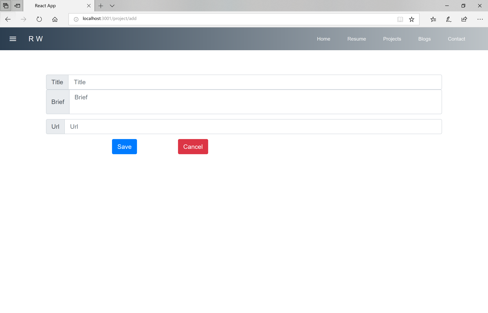

# D3

## 主要内容 

* project 添加页面 
* project 编辑页面 

## 地址 

* [主页](https://w158rk.github.io/)
* [代码](https://github.com/w158rk/w158rk.github.io)


--------------------

## 添加页面 

本来我是想去掉原来的bootstrap用mdl的，但mdl的输入框真的是不好看，所以还是装一下bootstrap 
吧，运行 

```sh 
npm install react-bootstrap bootstrap
```

并在`index.html`中添加 

```html 
<link
  rel="stylesheet"
  href="https://maxcdn.bootstrapcdn.com/bootstrap/4.3.1/css/bootstrap.min.css"
  integrity="sha384-ggOyR0iXCbMQv3Xipma34MD+dH/1fQ784/j6cY/iJTQUOhcWr7x9JvoRxT2MZw1T"
  crossorigin="anonymous"
/>
```

然后给`ProjectContainer`加个属性决定是要显示还是编辑，并把添加页面配置到路由里。

```html
<Route path="/projects/add" component={ProjectContainer} mode='add' />
```

然后就可以写ProjectCreator了，基本还是前面的一整套，但因为store已经有了，只需要更新 
reducer、action、api就可以了。

### Reducer 

其实reducer并不需要改，因为project和projects是两个不同的store，所以当编辑完成通过
保存或放弃退回到projects时，页面总是会重新fetch一下数据，获取到与数据库同步的数据并
显示。

### Action

action还是分begin、success、error。
* begin的时候要带着从用户处获取的要保存到数据库的数据，payload带project。 
* success之后因为要跳转，所以什么都不用做。
* 出错后只要把出错的信息输出一下就好了，所以payload带error。

### API 

create的话就是post到后端就可以了。

```js 
return dispatch => {

    dispatch( createProjectBegin(project) );
    return fetch(`${api_url}`,{
        method : 'POST',
        headers : API_HEADERS,
        body : JSON.stringify(project)
    })
    .then(handleErrors)
    .then(() => {
        dispatch( createProjectSuccess() );
    })
    .catch(error => dispatch( createProjectError(error) ));
    
}
```

### Component 

之前说过了，表单用bootstrap写，然后因为我不大会用form-submit那样的，所以我还是用
onChange + onClick这种的形式。所以component要维护一个project 状态，当输入框状态 
变化时要更新状态，所以这里用到另外一个工具`react-addons-update`。

其实就是一个用来copy对象维持状态的不可变性的，我用的原因也只是怕踩到关于状态更新的坑吧。然后写`handleChange`函数

```js 
import update from 'react-addons-update';

handleChange(e) {

    let {name, value} = e.target;

    const { project } = this.state;
    const newProject = update(project, {$merge : {[name] : value}});

    this.setState({
        project: newProject
    });
}
```

然后提交的时候就直接从组件状态中获取project，调用API的相关函数就可以了。同样的，我不想贴component的代码了，而且这一版的界面看起来也好奇怪啊，我之后可能还要改一改，大概的样子时



--------------------------

## 删除项目 

* 出于与添加相同的原因，删除也不需要修改reducer
* API里增加删除的函数 
* action里增加删除的action。
    - begin : 带projectId
    - success : 啥都不带 
    - error : 带error 
* 没有component

## 更新项目 

* reducer也不改
* API里增加更新的函数 
* action里增加更新的函数 
    - begin : 带项目id和新项目
    - success : 啥都不带 
    - error : 带error和就项目
* component跟creator一样， 只是带默认值

-----------------------

**BUG:** ： 以当前的逻辑，只有当用户从显示页面进入更新页面时才会出现默认值，通过url访问时不会出现默认值，之后的blog部分我应该会选择使用状态改变而不是页面跳转的方式控制更新与显示状态。


**后续：**：明天开始我会开始做后端了吧，因为blog跟project基本一模一样，都是获取数据，然后增删查改，所以就不重复地写两天废话了。明天开始面向project做一个REST API，接起来整个项目就差不多了吧（后面可能还有些样式修改什么的）。